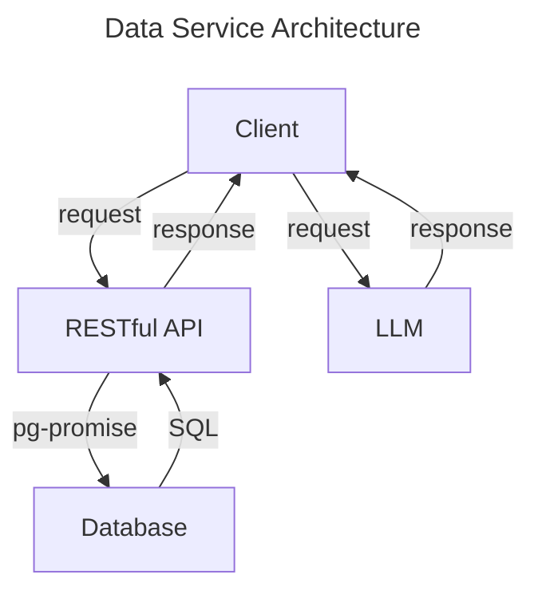

# Lingucidity Data Service

This is the data service application for [Lingucidity](https://github.com/Team-Equipo), which is deployed here: [https://jk249.azurewebsites.net/](https://jk249.azurewebsites.net/)

Here is a description of the endpoints:

HTTP Method | URL | Description
--- | --- | ---
GET | `/` | a hello world message
GET | `/user` | authenticate a user, and return credentials if valid
GET | `/user/{user_id}/phrase` | a list of phrases of a user with given `user_id`
GET | `/user/{user_id}/phrase/{phrase_id}` | a phrase with given `phrase_id` of a user with given `user_id`
POST | `/user` | create a new user

The data service is a RESTful API implemented using [Hapi](https://hapi.dev/) and deployed on [Microsoft Azure Web App Service](https://azure.microsoft.com/en-us/products/app-service/web). It provides access to the Lingucidity database hosted on [ElephantSQL](https://www.elephantsql.com/).

The data service also includes a _privately_ hosted inference endpoint for [Meta](https://www.meta.com/)'s [Llama 2](https://llama-2.ai/), an open source [7 billion parameter LLM](https://huggingface.co/meta-llama/Llama-2-7b-chat-hf). The LLM has been quantized to 4-bit precision using [AutoAWQ](https://github.com/casper-hansen/AutoAWQ) for our purposes and it is downloadable from [Calvin University](https://computing.calvin.edu/)'s [Hugging Face repository](https://huggingface.co/CalvinU/Llama-2-7b-chat-hf-awq). Please note that this endpoint is not publicly available, and will be removed from the data service in the future.

[Lingucidity Client](https://github.com/Team-Equipo/client)\
[Lingucidity Project](https://github.com/Team-Equipo/project)
